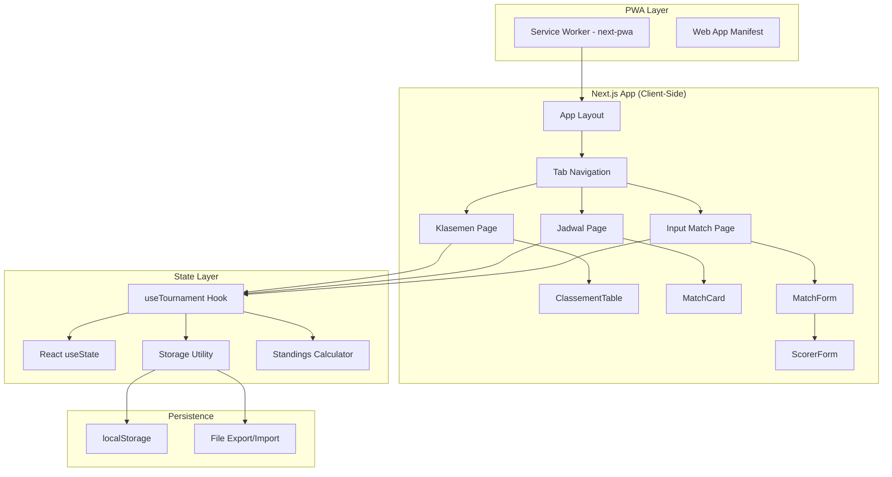
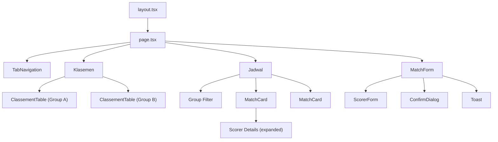

# Design Document: Copa Sawo Jajar

## Overview

Copa Sawo Jajar is a client-side Progressive Web Application for managing a local football tournament. It provides match score input, automatic standings calculation, schedule viewing, and data backup/restore — all running entirely in the browser with localStorage persistence.

The application is built with Next.js 14 (App Router), TypeScript, and TailwindCSS. A single custom hook (`useTournament`) manages all tournament state. The PWA is installable and fully functional offline after the initial load.

### Key Design Decisions

| Decision | Rationale |
|----------|-----------|
| Single `useTournament` hook | Keeps state centralized without Redux complexity; only 1-2 users, no concurrent writes |
| localStorage (single JSON key) | No backend needed for single-device use; instant read/write; survives browser close |
| Pre-generated match slots | 12 matches are deterministic (round-robin); avoids complex scheduling logic at runtime |
| next-pwa for service worker | Proven integration with Next.js; handles precaching and offline routing automatically |
| Mobile-first, bottom tabs | Primary use is at the field on a smartphone; bottom tabs enable one-handed operation |

## Architecture



### Data Flow

1. **Write path**: User submits form → `useTournament` validates → updates React state → `StorageUtil.save()` writes to localStorage → standings recalculated
2. **Read path**: App mounts → `StorageUtil.load()` reads localStorage → populates React state → components render
3. **Offline path**: Service worker intercepts network requests → serves precached assets → app operates normally against localStorage

## Components and Interfaces

### Folder Structure

```
src/
├── app/
│   ├── layout.tsx          # Root layout: metadata, fonts, PWA manifest link
│   ├── page.tsx            # Main page: tab state + conditional rendering
│   └── globals.css         # Tailwind base + custom utilities
├── components/
│   ├── TabNavigation.tsx   # Bottom tabs (mobile) / top tabs (desktop)
│   ├── Klasemen.tsx        # Standings view: renders both group tables
│   ├── ClassementTable.tsx # Reusable table for one group
│   ├── Jadwal.tsx          # Schedule view: filter + match list
│   ├── MatchCard.tsx       # Single match display (expandable)
│   ├── MatchForm.tsx       # Match input/edit form
│   ├── ScorerForm.tsx      # Sub-form for adding a scorer entry
│   ├── ConfirmDialog.tsx   # Reusable confirmation modal
│   ├── Toast.tsx           # Success/error notification component
│   └── OfflineIndicator.tsx# Network status banner
├── hooks/
│   └── useTournament.ts    # Central state management hook
├── types/
│   └── tournament.ts       # TypeScript interfaces & type guards
├── utils/
│   ├── storage.ts          # localStorage read/write/export/import
│   ├── calculations.ts     # Standings computation logic
│   └── validation.ts       # Form validation helpers
├── data/
│   └── teams.ts            # Pre-configured 8 teams + 12 match slots
└── public/
    ├── manifest.json       # PWA manifest
    ├── icons/              # App icons (192x192, 512x512)
    └── sw.js               # Generated by next-pwa
```

### Component Hierarchy



### Component Interfaces

```typescript
// TabNavigation
interface TabNavigationProps {
  activeTab: TabId;
  onTabChange: (tab: TabId) => void;
}
type TabId = 'klasemen' | 'jadwal' | 'input';

// ClassementTable
interface ClassementTableProps {
  group: Group;
  standings: StandingRow[];
}

// MatchCard
interface MatchCardProps {
  match: Match;
  teams: Team[];
  onEdit: (matchId: string) => void;
  onDelete: (matchId: string) => void;
}

// MatchForm
interface MatchFormProps {
  teams: Team[];
  matches: Match[];
  editingMatch: Match | null;
  onSubmit: (data: MatchFormData) => void;
  onCancel: () => void;
}

// ScorerForm
interface ScorerFormProps {
  homeTeam: Team;
  awayTeam: Team;
  onAdd: (scorer: Scorer) => void;
}

// ConfirmDialog
interface ConfirmDialogProps {
  open: boolean;
  title: string;
  message: string;
  onConfirm: () => void;
  onCancel: () => void;
}

// Toast
interface ToastProps {
  message: string;
  type: 'success' | 'error';
  durationMs?: number; // default 3000
}
```

### useTournament Hook Interface

```typescript
interface UseTournamentReturn {
  // State
  teams: Team[];
  matches: Match[];
  
  // Match operations
  submitMatch: (data: MatchFormData) => SubmitResult;
  updateMatch: (matchId: string, data: MatchFormData) => SubmitResult;
  deleteMatch: (matchId: string) => void;
  
  // Standings
  getStandings: (group: Group) => StandingRow[];
  
  // Scorers
  addScorer: (matchId: string, scorer: Scorer) => void;
  removeScorer: (matchId: string, scorerIndex: number) => void;
  
  // Data management
  exportData: () => void;
  importData: (file: File) => Promise<ImportResult>;
  resetAll: () => void;
  
  // Status
  isLoaded: boolean;
}

type SubmitResult = { success: true } | { success: false; error: string };
type ImportResult = { success: true } | { success: false; error: string };
```

## Data Models

```typescript
// === Core Types ===

type Group = 'A' | 'B';
type MatchStatus = 'upcoming' | 'live' | 'selesai';

interface Team {
  id: string;          // e.g., "team-a1", "team-b3"
  name: string;        // Display name
  group: Group;
}

interface Scorer {
  playerName: string;  // 1-50 chars, no whitespace-only
  teamId: string;      // Must be homeTeam or awayTeam of the match
  minute: number | null; // 1-200 inclusive, or null if not recorded
  count: number;       // 1-20, goals scored by this player in this event
}

interface Match {
  id: string;          // e.g., "match-01" through "match-12"
  group: Group;
  teamHomeId: string;
  teamAwayId: string;
  scoreHome: number;   // 0-99
  scoreAway: number;   // 0-99
  status: MatchStatus;
  scorers: Scorer[];   // Max 30 entries per match
  matchOrder: number;  // 1-12, for chronological sorting
  createdAt: string;   // ISO timestamp
  updatedAt: string;   // ISO timestamp
}

// === Derived Types ===

interface StandingRow {
  rank: number;
  team: Team;
  played: number;      // M
  wins: number;        // W
  draws: number;       // D
  losses: number;      // L
  goalsFor: number;    // GF
  goalsAgainst: number; // GA
  goalDifference: number; // GD = GF - GA
  points: number;      // 3*W + 1*D
}

// === Form Types ===

interface MatchFormData {
  group: Group;
  teamHomeId: string;
  teamAwayId: string;
  scoreHome: number;
  scoreAway: number;
  status: MatchStatus;
  scorers: Scorer[];
}

// === Storage Types ===

interface TournamentState {
  version: number;     // Schema version for future migrations
  teams: Team[];
  matches: Match[];
  exportedAt?: string; // Only present in backup files
}

// === Validation ===

function isValidTournamentState(data: unknown): data is TournamentState {
  // Type guard: checks version, teams array structure, matches array structure
}
```

### Storage Key & Schema

- **localStorage key**: `"copa-sawo-jajar-data"`
- **Schema version**: `1`
- **Max size**: 1 MB serialized (well within limits for 12 matches × 30 scorers max)

### Pre-configured Data Generation

```typescript
// data/teams.ts
const TEAMS: Team[] = [
  { id: 'team-a1', name: 'Team A1', group: 'A' },
  { id: 'team-a2', name: 'Team A2', group: 'A' },
  { id: 'team-a3', name: 'Team A3', group: 'A' },
  { id: 'team-a4', name: 'Team A4', group: 'A' },
  { id: 'team-b1', name: 'Team B1', group: 'B' },
  { id: 'team-b2', name: 'Team B2', group: 'B' },
  { id: 'team-b3', name: 'Team B3', group: 'B' },
  { id: 'team-b4', name: 'Team B4', group: 'B' },
];

// Round-robin: pair each team with every other in same group
function generateMatchSlots(teams: Team[]): Match[] {
  const matches: Match[] = [];
  let order = 1;
  for (const group of ['A', 'B'] as Group[]) {
    const groupTeams = teams.filter(t => t.group === group);
    for (let i = 0; i < groupTeams.length; i++) {
      for (let j = i + 1; j < groupTeams.length; j++) {
        matches.push({
          id: `match-${String(order).padStart(2, '0')}`,
          group,
          teamHomeId: groupTeams[i].id,
          teamAwayId: groupTeams[j].id,
          scoreHome: 0,
          scoreAway: 0,
          status: 'upcoming',
          scorers: [],
          matchOrder: order,
          createdAt: new Date().toISOString(),
          updatedAt: new Date().toISOString(),
        });
        order++;
      }
    }
  }
  return matches; // 6 + 6 = 12 matches
}
```

### Standings Calculation Algorithm

```typescript
function calculateStandings(matches: Match[], teams: Team[], group: Group): StandingRow[] {
  // 1. Filter teams by group
  const groupTeams = teams.filter(t => t.group === group);
  
  // 2. Filter completed matches for this group
  const completedMatches = matches.filter(
    m => m.group === group && m.status === 'selesai'
  );
  
  // 3. For each team, aggregate stats from completed matches
  const rows: StandingRow[] = groupTeams.map(team => {
    let played = 0, wins = 0, draws = 0, losses = 0, gf = 0, ga = 0;
    
    for (const match of completedMatches) {
      if (match.teamHomeId === team.id) {
        played++;
        gf += match.scoreHome;
        ga += match.scoreAway;
        if (match.scoreHome > match.scoreAway) wins++;
        else if (match.scoreHome === match.scoreAway) draws++;
        else losses++;
      } else if (match.teamAwayId === team.id) {
        played++;
        gf += match.scoreAway;
        ga += match.scoreHome;
        if (match.scoreAway > match.scoreHome) wins++;
        else if (match.scoreAway === match.scoreHome) draws++;
        else losses++;
      }
    }
    
    return {
      rank: 0, // assigned after sort
      team,
      played, wins, draws, losses,
      goalsFor: gf,
      goalsAgainst: ga,
      goalDifference: gf - ga,
      points: wins * 3 + draws * 1,
    };
  });
  
  // 4. Sort: Points DESC → GD DESC → GF DESC → Name ASC (alphabetical tiebreaker)
  rows.sort((a, b) => {
    if (b.points !== a.points) return b.points - a.points;
    if (b.goalDifference !== a.goalDifference) return b.goalDifference - a.goalDifference;
    if (b.goalsFor !== a.goalsFor) return b.goalsFor - a.goalsFor;
    return a.team.name.localeCompare(b.team.name);
  });
  
  // 5. Assign ranks
  rows.forEach((row, i) => { row.rank = i + 1; });
  
  return rows;
}
```


## Correctness Properties

*A property is a characteristic or behavior that should hold true across all valid executions of a system — essentially, a formal statement about what the system should do. Properties serve as the bridge between human-readable specifications and machine-verifiable correctness guarantees.*

### Property 1: Group Filter Shows Only Correct Teams

*For any* group selection (A or B) and any set of teams, the filtered team list SHALL contain only teams whose `group` field matches the selected group, and SHALL contain all such teams.

**Validates: Requirements 1.2**

### Property 2: Same-Team Validation

*For any* team, selecting it as both the home team and away team SHALL produce a validation error, regardless of group or other form state.

**Validates: Requirements 1.4**

### Property 3: Score Range Validation

*For any* integer value in the range 0 to 99 (inclusive), score validation SHALL accept it. *For any* value that is not an integer or falls outside 0-99, score validation SHALL reject it.

**Validates: Requirements 1.5**

### Property 4: Duplicate Match Pairing Detection

*For any* existing set of matches in a group and any new match submission, if the home/away team pairing (in either order) already exists in that group, the submission SHALL be rejected with a duplicate error.

**Validates: Requirements 1.8**

### Property 5: Scorer Field Validation

*For any* scorer entry, the system SHALL accept it if and only if: player name is 1-50 non-whitespace-only characters, team is one of the two match teams, goal count is an integer 1-20, and minute (if provided) is an integer 1-200. *For any* string composed entirely of whitespace, scorer submission SHALL be rejected.

**Validates: Requirements 2.1, 2.6**

### Property 6: Scorer List Integrity

*For any* match with N scorer entries (0 ≤ N ≤ 30), adding a valid scorer SHALL result in N+1 entries with the new scorer present. Removing a scorer at index i SHALL result in N-1 entries with that scorer absent and all other scorers unchanged.

**Validates: Requirements 2.3, 2.5**

### Property 7: Standings Computation Correctness

*For any* set of matches with status "Selesai" in a group, the standings calculator SHALL produce team rows where: (a) each team's Played count equals the number of completed matches involving that team, (b) Points equals 3×Wins + 1×Draws, (c) GD equals GF minus GA, (d) W+D+L equals Played, and (e) teams are sorted by Points descending, then GD descending, then GF descending, then team name ascending.

**Validates: Requirements 3.2, 3.3, 3.4**

### Property 8: Match Order Sort Invariant

*For any* list of matches displayed in the Jadwal view, the matches SHALL appear in non-decreasing order of their `matchOrder` field.

**Validates: Requirements 4.6**

### Property 9: Match Group Filter Correctness

*For any* group filter selection and any set of matches, the filtered result SHALL contain exactly the matches whose `group` field equals the selected filter, and no others.

**Validates: Requirements 4.8**

### Property 10: Unrestricted Status Transitions

*For any* match with any current status (upcoming, live, selesai) and any target status, the status change SHALL succeed without error, persisting the new status.

**Validates: Requirements 5.4**

### Property 11: Delete Resets Match to Default

*For any* match regardless of its current scores, scorers, or status, deleting it SHALL produce a match with status "upcoming", scoreHome 0, scoreAway 0, empty scorers array, and the same id/group/teamHomeId/teamAwayId/matchOrder.

**Validates: Requirements 6.4**

### Property 12: Invalid Storage Data Recovery

*For any* string stored in the localStorage key that is not valid JSON or does not conform to the TournamentState schema (missing fields, wrong types, invalid status values), the Storage_Manager SHALL discard it and return the default initial state with pre-configured teams and empty match slots.

**Validates: Requirements 7.3**

### Property 13: Export/Import Round-Trip

*For any* valid tournament state, exporting to JSON and then importing that JSON SHALL produce a state equivalent to the original (all teams, matches, scores, scorers, and statuses preserved).

**Validates: Requirements 8.1, 8.4**

### Property 14: Invalid Import File Rejection

*For any* file content that is not valid JSON or does not contain the required Teams and Matches structures, import SHALL fail with an error and the existing tournament state SHALL remain unchanged.

**Validates: Requirements 8.6**

### Property 15: Reset Preserves Structure But Clears Results

*For any* tournament state, after a reset: (a) all 8 teams SHALL still exist with correct group assignments, (b) all 12 match slots SHALL still exist with correct team pairings and matchOrder values, (c) all matches SHALL have status "upcoming", scoreHome 0, scoreAway 0, and empty scorers.

**Validates: Requirements 9.3, 9.5**

### Property 16: Round-Robin Match Generation

*For any* group of N teams, the generated match slots SHALL contain exactly N×(N-1)/2 matches, and each team SHALL be paired with every other team in the group exactly once.

**Validates: Requirements 11.2**

### Property 17: Initialization Idempotency

*For any* valid existing TournamentState in localStorage, calling the initialization function SHALL not modify the data — the state before and after initialization SHALL be identical.

**Validates: Requirements 11.4**

## Error Handling

### Storage Errors

| Error | Detection | Response |
|-------|-----------|----------|
| localStorage quota exceeded | `try/catch` around `setItem` | Display toast: "Data could not be saved. Storage full." Retain in-memory state. |
| Corrupted localStorage data | `isValidTournamentState()` type guard fails | Discard data, initialize defaults, display notification. |
| localStorage unavailable (private browsing) | Feature detection on mount | Display persistent banner; app works in-memory only. |

### Import Errors

| Error | Detection | Response |
|-------|-----------|----------|
| File is not valid JSON | `JSON.parse` throws | Display error toast: "Invalid file format." Retain existing data. |
| JSON lacks required fields | Schema validation fails | Display error toast: "File is missing required data." Retain existing data. |
| File too large | Check `file.size > 1MB` before parsing | Display error toast: "File exceeds maximum size." |

### Validation Errors

| Error | Detection | Response |
|-------|-----------|----------|
| Same team selected | `teamHomeId === teamAwayId` | Inline error on away team dropdown. Prevent submit. |
| Score out of range | `score < 0 \|\| score > 99 \|\| !Number.isInteger(score)` | Inline error on score field. |
| Duplicate match pairing | Check existing matches for same pair | Inline error with message. Prevent submit. |
| Empty/whitespace player name | `playerName.trim().length === 0` | Inline error on scorer name field. |
| Scorer name too long | `playerName.trim().length > 50` | Inline error with character count. |

### Network Errors

Since the app is fully client-side with no API calls, network errors only affect:
- Initial PWA asset loading (handled by service worker cache-first strategy)
- Connectivity detection uses `navigator.onLine` + `online`/`offline` events for the indicator

## Testing Strategy

### Unit Tests (Vitest + React Testing Library)

Focus on specific examples, edge cases, and component rendering:

- **Components**: Render tests for MatchForm, ClassementTable, MatchCard, TabNavigation
- **Edge cases**: Empty state, maximum scorer limit (30), boundary scores (0, 99)
- **Validation**: Specific invalid inputs (negative score, empty name, same team)
- **UI interactions**: Form submission resets, confirmation dialogs, toast display

### Property-Based Tests (fast-check + Vitest)

Each property test runs **minimum 100 iterations** with generated inputs.

**Library**: [fast-check](https://github.com/dubzzz/fast-check) — mature, TypeScript-native PBT library

**Configuration**:
```typescript
import fc from 'fast-check';

// Each test tagged with property reference
// Feature: copa-sawo-jajar, Property {N}: {title}
fc.assert(
  fc.property(
    arbitraryMatchSet, // custom arbitrary for match data
    (matches) => { /* property assertion */ }
  ),
  { numRuns: 100 }
);
```

**Custom Arbitraries needed**:
- `arbitraryTeam` — generates valid Team objects
- `arbitraryScorer` — generates valid Scorer objects (name 1-50 chars, count 1-20, minute 1-200 or null)
- `arbitraryMatch` — generates valid Match objects with consistent team references
- `arbitraryMatchSet` — generates sets of 12 matches for a complete tournament
- `arbitraryTournamentState` — generates full valid TournamentState
- `arbitraryInvalidJson` — generates strings that are not valid JSON or invalid schema

**Property tests cover**:
- Properties 1-17 as defined in Correctness Properties section
- Focus on pure functions: `calculateStandings`, `validateMatch`, `validateScorer`, `generateMatchSlots`, storage serialization/deserialization

### Integration Tests

- localStorage persistence: save → reload → verify state restored
- Service worker: asset caching verification
- Full user flows: input match → verify standings update → verify jadwal update

### Test File Organization

```
src/
├── __tests__/
│   ├── calculations.test.ts      # Unit tests for standings logic
│   ├── calculations.property.ts  # Property tests for standings (Props 7, 8)
│   ├── validation.test.ts        # Unit tests for form validation
│   ├── validation.property.ts    # Property tests for validation (Props 2-5)
│   ├── storage.test.ts           # Unit tests for storage utils
│   ├── storage.property.ts       # Property tests for storage (Props 12-14, 17)
│   ├── tournament.test.ts        # Unit tests for useTournament hook
│   ├── tournament.property.ts    # Property tests for tournament ops (Props 6, 10, 11, 15, 16)
│   ├── matchGeneration.property.ts # Property tests for round-robin (Prop 16)
│   └── components/
│       ├── MatchForm.test.tsx
│       ├── ClassementTable.test.tsx
│       ├── Jadwal.test.tsx
│       └── MatchCard.test.tsx
```

### PWA Testing

- **Lighthouse audit**: Score ≥ 90 on PWA criteria
- **Offline manual test**: Disable network after first load, verify all features work
- **Install test**: Verify "Add to Home Screen" prompt triggers on mobile

### Service Worker Strategy

Using `next-pwa` with the following configuration:

```javascript
// next.config.js
const withPWA = require('next-pwa')({
  dest: 'public',
  register: true,
  skipWaiting: true,
  disable: process.env.NODE_ENV === 'development',
  runtimeCaching: [
    {
      urlPattern: /^https?.*/,
      handler: 'NetworkFirst',
      options: {
        cacheName: 'offlineCache',
        expiration: { maxEntries: 200 },
      },
    },
  ],
});
```

**Precaching**: All static assets (HTML, CSS, JS, icons) are precached on service worker install.
**Runtime**: Network-first strategy for any dynamic requests (though none expected in this app).
**Offline indicator**: Uses `navigator.onLine` + event listeners to show/hide a banner component.
